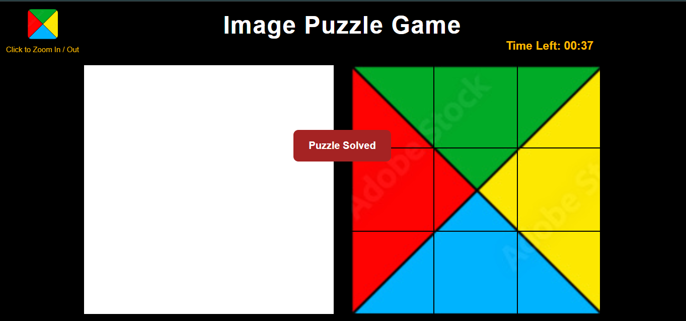

# Image Puzzle Game

I created a project called Image Puzzle Game.In this game first you choose any image you like and then select a difficulty easy, medium and hard.

- Easy 3x3 grid 1 min timer
- Medium 4x4 grid 1 min 30 sec timer
- Hard 5x5 grid 2 min 30 sec timer

After selecting the difficulty image turn into pieces and then you drag the piece and drop into solved grid to remake the image by placing all the peices in the correct place.

# opinion on choosing image

When i was playing the game then i realized that in medium and hard levels the puzzle pieces become smaller. if the image has a lot of the same color  then many pieces look same making it difficult to place them in correct position.

So in my opinion it is better to choose image that does not have large areas of the same color.

## Built with
- HTML
- CSS
- JavaScript

## Screenshot

